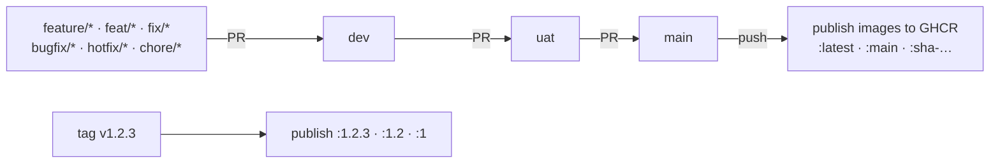

# Capgemini dbt Portal (FastAPI + React)

Standalone replacement for the Streamlit-based `streamlit_dashboard/` portal in
`capgemini_dbt_core`. **The Streamlit app stays live and is the system of
record until this app covers feature parity** — see Status below.

## Why this exists

The old portal fought Streamlit's rerun model for anything long-running
(background dbt jobs, live log output) and had no real session/cookie API,
forcing workarounds (`st.fragment(run_every=2)` polling, an iframe
`document.cookie` hack). This app replaces both with what the framework
naturally gives you: WebSocket push for live output, real `Authorization`
headers/JWTs for auth.

Same env-var contract as the old portal, so it points at any client dbt
project without code changes: `DBT_PROJECT_DIR` / `WORKSPACE_ROOT` /
`PROJECT_ROOT`, in that precedence order (see `backend/app/core/config.py`).

**Shipping this to a client?** They don't need this repo. They get
[deploy/client/](deploy/client/) — two pre-built images (published by
[.github/workflows/publish-images.yml](.github/workflows/publish-images.yml)),
one compose file, one `.env` with a single line (where their dbt project is).
Warehouse credentials come from that project's own `.env`; the session secret
and initial account passwords are generated on first start. Full details, plus
Kubernetes/bare-VM/bake variants: [docs/ONBOARDING.md](docs/ONBOARDING.md).

## Structure

```
backend/    FastAPI app (Python) — auth, dbt command building/execution, WebSocket log streaming
frontend/   React + TypeScript + Vite — UI, ported 1:1 in visual language from the old Streamlit theme
```

## Running (containers only — Podman or Docker)

The app is meant to run the way it will in production: two containers, no
host Python or Node required. Kubernetes, a bare VM, and baking the dbt
project into the image are also supported — see
[docs/ONBOARDING.md](docs/ONBOARDING.md) for those paths.

```
browser -> nginx :8080 (serves the SPA, proxies /api incl. WebSocket)
                 └──> backend :8000 (FastAPI + dbt, internal network only)
                          └── /workspace: bind-mounted, git-cloned, or baked
                              client dbt project (docs/ONBOARDING.md §3)
```

```bash
cp .env.example .env     # set DBT_PROJECT_PATH (or _GIT_URL) -- that's the only required line
podman compose up --build -d      # or: podman-compose up --build -d
# open http://localhost:8080
```

Before starting the stack (or any time something looks misconfigured), run
the standalone check — validates the project, dbt profile/target/adapter and
warehouse env vars, no server required:

```powershell
cd backend
.\run_fastapi.ps1 -Command preflight
```

Notes:
- **Podman needs a compose provider.** `podman compose` shells out to
  `docker-compose` or `podman-compose`; `pip install --user podman-compose`
  works (add its `Scripts` dir to `PATH`).
- **`DBT_PROJECT_PATH` must be relative to `compose.yaml`** (e.g.
  `../capgemini_dbt_core`). On Windows, Podman's client mangles absolute
  `/mnt/c/...` paths into `/mnt/c/mnt/c/...`. No host folder to mount? Set
  `DBT_PROJECT_GIT_URL` instead (docs/ONBOARDING.md §3) — the backend clones
  it into a named volume on start.
- The backend image carries its own dbt (`dbt-core` + `dbt-snowflake`), since a
  host virtualenv can't be used across the Windows/Linux container boundary.
  dbt writes `target/`, `logs/` and `dbt_packages/` into the mounted project.
  A different warehouse adapter or a pinned dbt version: build with
  `--build-arg EXTRA_PIP_PACKAGES="dbt-bigquery~=1.8.0"` (or set
  `EXTRA_PIP_PACKAGES` in `.env` for compose).
- **`up --build` does not recreate a running container** under podman-compose;
  use `podman-compose down && podman-compose up -d` after code changes.
- Snowflake credentials (`DBT_PKG_*`) come from `.env` and are read by the
  client project's `profiles.yml`. Without them `dbt debug` fails with
  `'user' is a required property`, which is the correct behavior.

The stack starts in **production mode** by default: each seeded account gets a
random password, printed once in the backend log (`podman logs <backend>`).
For a local demo with the documented accounts, set `ENVIRONMENT=development`
in `.env`: `admin` / `admin123!`, `engineer` / `engineer123!`,
`analyst` / `analyst123!`, `auditor` / `auditor123!`. Production refuses to
start if any `SEED_*_PASSWORD` is set to one of these.

## Status

Every page of the old Streamlit portal is ported: Home, Onboarding, dbt
Runner, SQL Linter, Profiler, dbt Docs, Elementary, Colibri, Assets, DWH
FinOps, Airflow, Ask AI, and Governance.

Platform features:

- **Sessions** use httpOnly, SameSite=Strict cookies: a 15-minute access token
  renewed silently from a rotating 7-day refresh token. Logout, disabling an
  account or resetting its password revokes its sessions. Scripts can still
  call the API with `Authorization: Bearer`.
- **Scheduler**: cron schedules for any dbt Runner command (the *Schedules*
  button on the Runner page). Each slot fires exactly once, however many
  backend replicas run.
- **Failure alerts** to Slack, Microsoft Teams and email, for manual and
  scheduled runs (Governance → Failure alerts).
- **Durable state**: running jobs, run history and the sign-in lockout live in
  the portal database, so a restart loses nothing. A job whose backend died
  is marked failed within about 2.5 minutes.
- **Observability**: JSON logs with a request id on every line, and
  Prometheus metrics at `/metrics` on the backend's internal port.
- **Airflow**: with `AIRFLOW_URL` and a service account set, list DAGs, see
  recent runs, pause/unpause and trigger them from the portal.
- **Airbyte**: connect a self-hosted (`abctl`) or Cloud Airbyte to list
  connections with their last sync, run and cancel syncs, and browse sync
  history (docs/ONBOARDING.md, section 5a).
- **Tools & Services**: one page with every integrated tool's live status,
  version, config variables and next step when it isn't working.
- **UI**: light and dark theme, line icons, a crash screen per page instead of
  a blank app, and keyboard focus rings with a skip-to-content link.

Known limits:

- More than one backend replica needs PostgreSQL (`DATABASE_URL`). Live log
  streaming and *Cancel* work on the replica running the job; other replicas
  show the stored tail once it finishes.
- Run history persists to the portal database, not to Snowflake
  `PORTAL_DBT_EXECUTIONS` like the old portal.
- Email sign-in codes are still held in process memory, so with several
  replicas the code must be redeemed on the replica that sent it.
- Images are built as OCI format by default, which drops image-level
  `HEALTHCHECK`; healthchecks therefore live in `compose.yaml` instead.

## Branches and CI

Changes are promoted through three branches, only by pull request:



| Workflow | Runs on | Checks |
| :-- | :-- | :-- |
| [pre-check.yml](.github/workflows/pre-check.yml) | every PR into `dev`, `uat`, `main` | gitleaks secret scan; promotion path (`dev` only from the branch prefixes above, `uat` only from `dev`, `main` only from `uat`); backend `ruff check` + `ruff format --check`, every module imports, `pytest`; frontend `npm ci`, `eslint`, Vitest, `tsc` + `vite build` |
| [publish-images.yml](.github/workflows/publish-images.yml) | PRs into `dev`/`uat`/`main` (build + scan); pushes to `main` and `v*.*.*` tags (build + scan + publish) | Both Dockerfiles build; Trivy fails the run on a fixable HIGH/CRITICAL vulnerability, before anything is pushed (accepted findings go in [.trivyignore](.trivyignore)) |
| [e2e-smoke.yml](.github/workflows/e2e-smoke.yml) | PRs into `uat`/`main`, and on demand | Builds the compose stack and runs the Playwright smoke test: sign in, run `dbt debug`, see it in the history |

Before opening a PR, run the same checks locally:

```bash
python -m pip install -r backend/requirements.txt -r backend/requirements-dev.txt -c backend/constraints.txt
python -m ruff check . && python -m ruff format --check .
cd backend && python -m pytest && cd ..
cd frontend && npm ci && npm run lint && npm test && npm run build
```

`frontend/package-lock.json` is committed so CI and image builds install the same versions;
commit it whenever `package.json` changes.
