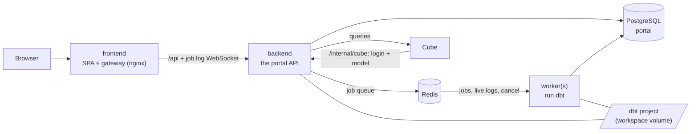

# Architecture

The portal is one backend (the API), its dbt workers, a gateway and a
semantic engine, with PostgreSQL and Redis. This page explains what each
container owns, how they talk to each other, and what that means when you run
or change them.

## Containers

| Container | Image | Owns | Reads | Scales |
|---|---|---|---|---|
| **backend** | `-backend`, `EXECUTION_ROLE=api` | users, roles, sessions, audit trail, run history, schedules, alert settings (PostgreSQL); the dbt editor; the Cube warehouse login and data model (`/data/cube`) | the dbt project (read-write), its artifacts, the warehouse | one (more with a ReadWriteMany `/data`) |
| **worker** | `-backend`, `python -m app.worker` | the dbt processes; fires schedules | the dbt project (read-write) | one per N concurrent jobs |
| **cube** | `-cube` | nothing | its configuration, from the backend | any number |
| **frontend** | `-frontend` | nothing | — | any number |
| **postgres**, **redis** | public images | the database; the job queue and live logs | — | one (or the platform's managed services) |

**One image.** The backend and the workers are the same image
(`capgemini-dbt-portal-backend`); the command and `EXECUTION_ROLE` decide
which one a container is. Without `EXECUTION_ROLE=api` and Redis, the backend
runs dbt itself: that is the single-node portal (`compose.single.yaml`,
SQLite), and what developers run locally.

Inside, the code is still organised as four areas (identity, execution,
insights, semantic), defined in the backend repo's
[app/core/services.py](https://github.com/omaryehia015/capgemini-dbt-portal-backend/blob/main/app/core/services.py).
Up to release 2026.10 each ran as its own container, and the code can still
run them apart (`PORTAL_SERVICES`, `*_URL`), but no deployment here does.

## How the containers talk to each other

**Browser to backend: the gateway.** The browser only ever talks to the
frontend container. Its nginx serves the SPA and proxies `/api` (including
the job log WebSocket) to the backend. The session is an httpOnly cookie
signed with `JWT_SECRET`. The gateway does not proxy `/internal`, so a browser
cannot reach it.

**Jobs: Redis.** The backend does not run dbt jobs itself. It pushes a job request onto a
Redis list and waits (up to 20 s) for a worker's reply, which is the job's
first status, or why it could not start. The worker builds the plan (reading
the dbt project), runs it, and appends every log line and the final status to
a Redis stream for that job. The backend serves the job's live log over the
WebSocket from that stream, and *Cancel* is a message on a Redis channel that
the worker running the job acts on. The run history itself is in PostgreSQL,
written by the worker as the job starts and finishes, with a heartbeat so a
crashed worker's jobs are marked interrupted.

Redis also carries cache invalidation (a worker that finishes a SQLFluff or
profiler run tells the backend to drop its cache) and email sign-in codes.
Nothing in Redis has to survive a restart.

**Cube: HTTP, no shared disk.** The backend keeps Cube's warehouse login and
generated data model on its `/data` volume. Cube's `cube.js` polls
`/internal/cube/state` every few seconds; when the model or login version
changes it fetches the new one, and Cube recompiles. Both directions use
`CUBE_API_SECRET`: the backend signs its queries to Cube with it, Cube signs
its configuration requests with it. The format of that API is versioned
(`cube_contract`): the cube image says which version it speaks, and logs an
error at start when the backend speaks another.

## Data

- **PostgreSQL, one database** (`portal`). The schema is migrated on start
  (Alembic, one migration line per area: `alembic_version_identity`,
  `alembic_version_execution`), serialized across replicas by an advisory lock.
- **SQLite** for the single-node portal only.
- **`/data`** (volume `portal_data`): the dbt editor's trash, the key stored
  credentials are encrypted with (`secret.key`, unless `PORTAL_SECRET_KEY`
  is set), Cube's state.
- **The dbt project** is a shared folder (volume): the backend clones or
  edits it and reads what runs produce, workers run dbt in it. On Kubernetes
  that is a ReadWriteMany volume when pods span nodes.

**Upgrading from 2026.10 or earlier** (separate identity/execution databases
and service volumes): compose's one-off `upgrade` service
([postgres/upgrade.sh](../postgres/upgrade.sh)) moves the data into the one
database and volume before the backend first starts, and leaves the old ones
as a backup. On Kubernetes, see [ONBOARDING.md](ONBOARDING.md).

## Versions and compatibility

Each repo releases on its own (`vX.Y.Z` tag → images `X.Y.Z`, `X.Y`,
`latest`). The deploy repo's `releases.yml` lists the combinations that
passed the end-to-end smoke test together; deployments pin one of them.
Two contracts keep independently released pieces honest:

- **Frontend ↔ backend: the public API.** The backend commits its OpenAPI
  schema (`openapi.json`, checked in CI). The frontend generates its types
  from it (`npm run gen:api`), so a breaking backend change becomes a type
  error in the frontend's build. At runtime the backend reports its API
  version on `GET /api/version`; the frontend shows a warning banner when the
  major differs from the one it was built for.
- **Backend ↔ cube: `/internal/cube`.** Versioned as `cube_contract` (backend
  `cube_manager.CONTRACT_VERSION`, cube image `CUBE_CONTRACT`).

Changing either contract incompatibly means bumping its major and releasing
the two sides together (one new `releases.yml` entry).

## Changing things

| Change | Where | Notes |
|---|---|---|
| A page's API | backend repo, then `python -m app.openapi > openapi.json`; frontend repo, `npm run gen:api` | two PRs, released as one `releases.yml` entry |
| A table | backend repo: edit `app/db/tables.py`, then `python -m app.db.migrate revision <identity\|execution> "<what>"` | the owning area's migration line |
| Cube's configuration API | backend `cube_manager.py` + cube repo `cube.js` | bump `CONTRACT_VERSION` / `CUBE_CONTRACT` together |
