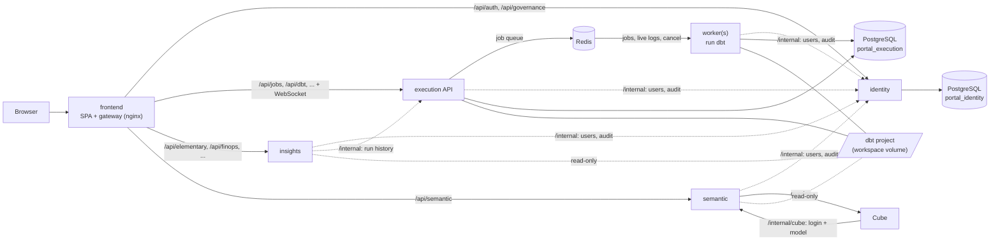

# Architecture

The portal is four backend services, a gateway and a semantic engine. Each
runs in its own container, and each container scales and is released on its
own. This page explains what each one owns, how they talk to each other, and
what that means when you run or change them.

## Services

| Service | Image | Owns | Reads | Scales |
|---|---|---|---|---|
| **identity** | `-identity` | users, roles, policies, sessions, sign-in lockouts, the audit trail (`portal_identity`) | — | stateless, any number |
| **execution** (API) | `-backend`, `EXECUTION_ROLE=api` | run history, schedules, alert settings (`portal_execution`); the dbt editor | the dbt project (read-write) | stateless, any number |
| **worker** | `-backend`, `python -m app.worker` | the dbt processes; fires schedules | the dbt project (read-write) | one per N concurrent jobs |
| **insights** | `-insights` | nothing (caches only) | the dbt project's artifacts (read-only), the warehouse | stateless, any number |
| **semantic** | `-semantic` | the Cube warehouse login and data model (`/data/cube`) | the dbt manifest and profile (read-only) | one |
| **cube** | `-cube` | nothing | its configuration, from semantic | any number |
| **frontend** | `-frontend` | nothing | — | any number |

Which routes belong to which service is defined once, in the backend repo's
[app/core/services.py](https://github.com/omaryehia015/capgemini-dbt-portal-backend/blob/main/app/core/services.py);
the gateway's routing table (frontend repo, `nginx/default.conf.template`)
mirrors it.

**One codebase, many images.** The four backend services share one
repository and one Python package. `PORTAL_SERVICES` decides which routers a
container mounts and which tables it migrates; the Dockerfile's `SERVICE`
build arg decides which dependencies the image carries (only the backend
image has dbt). `PORTAL_SERVICES=all` runs everything in one process: that
is the single-node portal, and what developers run locally.

## How services talk to each other

**Browser to services: the gateway.** The browser only ever talks to the
frontend container. Its nginx routes each `/api` prefix to one service. The
session is an httpOnly cookie, and every service verifies it the same way:
each one has the same `JWT_SECRET`.

**Service to service: `/internal`.** When a service needs another one, it
calls that service's `/internal/...` HTTP API with a 60-second token signed
with `JWT_SECRET` and marked `scope: internal`. A login token is never
accepted there and an internal token is never accepted as a login. The
gateway does not proxy `/internal`, so a browser cannot reach it. The calls:

| Caller | Calls | Why |
|---|---|---|
| every service | identity `GET /internal/identity/users/{name}` | the signed-in user's current role and permissions, cached 10 s (a disabled user is refused everywhere within 10 s) |
| every service | identity `POST /internal/identity/audit` | audit events; kept and retried if identity is briefly unreachable |
| insights | execution `GET /internal/execution/jobs` | recent runs, for the home page's recommendations |
| execution | semantic `GET /internal/semantic/status` | the Tools page's Cube card |
| cube | semantic `GET /internal/cube/{state,connection,model}` | its warehouse login and data model (below) |

In-process, the same calls are plain function calls: the code goes through
`app/clients/`, which checks whether the other service is hosted in this
process.

**Jobs: Redis.** The execution API never runs dbt. It pushes a job request
onto a Redis list and waits (up to 20 s) for a worker's reply, which is the
job's first status, or why it could not start. The worker builds the plan
(reading the dbt project), runs it, and appends every log line and the final
status to a Redis stream for that job. Any execution replica can then serve
the job's live log over the WebSocket, and *Cancel* is a message on a Redis
channel that the worker running the job acts on. The run history itself is in
PostgreSQL, written by the worker as the job starts and finishes, with a
heartbeat so a crashed worker's jobs are marked interrupted.

Redis also carries cache invalidation (a worker that finishes a SQLFluff or
profiler run tells insights to drop its cache) and email sign-in codes (any
identity replica can redeem a code another issued). Nothing in Redis has to
survive a restart.

**Cube: HTTP, no shared disk.** The semantic service keeps Cube's warehouse
login and generated data model on its own volume. Cube's `cube.js` polls
`/internal/cube/state` every few seconds; when the model or login version
changes it fetches the new one, and Cube recompiles. Both directions use
`CUBE_API_SECRET`: semantic signs its queries to Cube with it, Cube signs its
configuration requests with it. The format of that API is versioned
(`cube_contract`): the cube image says which version it speaks, and logs an
error at start when the semantic service speaks another.

## Data

- **PostgreSQL, one database per service that owns tables**: `portal_identity`
  and `portal_execution`. A service never reads another's tables; it asks the
  service. Each service applies its own schema migrations (Alembic, its own
  version table) on start, serialized across replicas by an advisory lock.
- **SQLite** remains for the single-node portal only.
- **The dbt project** is a shared folder (volume): the execution API clones
  or edits it, workers run dbt in it, insights and semantic read it. On
  Kubernetes that is a ReadWriteMany volume when pods span nodes.

## Versions and compatibility

Each repo releases on its own (`vX.Y.Z` tag → images `X.Y.Z`, `X.Y`,
`latest`). The deploy repo's `releases.yml` lists the combinations that
passed the end-to-end smoke test together; deployments pin one of them.
Two contracts keep independently released pieces honest:

- **Frontend ↔ backend: the public API.** The backend commits its OpenAPI
  schema (`openapi.json`, checked in CI). The frontend generates its types
  from it (`npm run gen:api`), so a breaking backend change becomes a type
  error in the frontend's build. At runtime the backend reports its API
  version on `GET /api/version`; the frontend shows a warning banner when the
  major differs from the one it was built for.
- **Semantic ↔ cube: `/internal/cube`.** Versioned as `cube_contract` (backend
  `cube_manager.CONTRACT_VERSION`, cube image `CUBE_CONTRACT`).

Changing either contract incompatibly means bumping its major and releasing
the two sides together (one new `releases.yml` entry).

## Changing things

| Change | Where | Notes |
|---|---|---|
| A page's API | backend repo, then `python -m app.openapi > openapi.json`; frontend repo, `npm run gen:api` | two PRs, released as one `releases.yml` entry |
| A table | backend repo: edit `app/db/tables.py`, then `python -m app.db.migrate revision <service> "<what>"` | the owning service's migration line only |
| Which service serves a route | `app/core/services.py` and the gateway's `nginx/default.conf.template` | keep them in step |
| A new cross-service call | add an `/internal` route and a function in `app/clients/` | never import another service's tables |
| Cube's configuration API | backend `cube_manager.py` + cube repo `cube.js` | bump `CONTRACT_VERSION` / `CUBE_CONTRACT` together |
